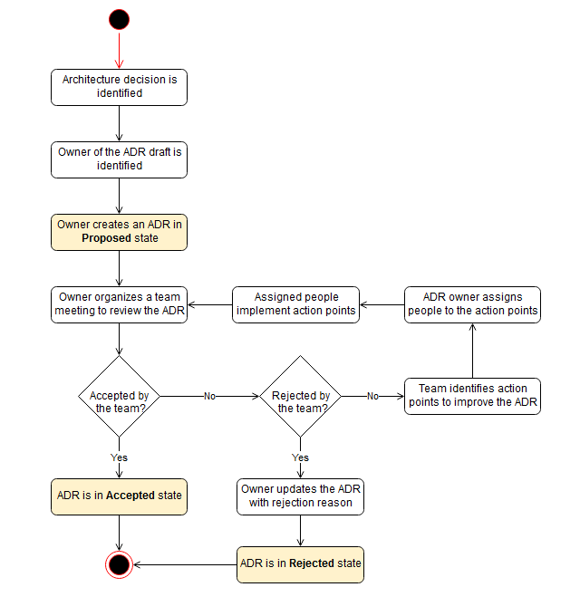

# ADR Process

## Overview

An [architectural decision record](./adr-template.md) (ADR) is a document that describes a choice the team makes 
about a significant aspect of the software architecture they’re planning to build.

The ADR process outputs a collection of architectural decision records.
This collection creates the [decision log](.). The decision log provides the project context
as well as detailed implementation and design information.

Project members skim the headlines of each ADR to get an overview of the project context.
They read the ADRs to dive deep into project implementations and design choices.
When the team accepts an ADR, it becomes immutable. If new insights require a different decision,
the team proposes a new ADR. When the team accepts the new ADR, it supersedes the previous ADR.

## When ADR is needed

In our context usually an ADR is based on functional requirements represented as an epic.
Some signs that you might need an ADR:
1. Implementing a new major feature
2. Huge refactoring in codebase
3. The solution can not be expressed in a couple of sentences in an issue
4. The solution has several alternatives that need to be considered
5. The decision in previous ADR needs to be reconsidered

## How to propose an Architectural Decision

Make a copy of [adr-template](./adr-template.md) in this directory. Rename it to `{creation-date}-{adr-title}.md` (e.g. `01-01-2024-plugins.md`).
We use the date so it's possible to sort them correctly by file name. 

Fill the sections that you find relevant for the discussion. Feel free to add additional sections if needed.
The template is not strict. You can use any ADR structure that feels best for a particular case.
See these ADR examples for inspiration:
- [Cassandra SEP - Ganeral Purpose Transactions](https://cwiki.apache.org/confluence/display/CASSANDRA/CEP-15%3A+General+Purpose+Transactions)
- [Rust RFC - Lifetime Ellision](https://github.com/rust-lang/rfcs/blob/master/text/0141-lifetime-elision.md)
- [TiKV - Use Joint Consensus](https://github.com/tikv/rfcs/blob/master/text/0054-joint-consensus.md)

Both Russian and English languages are allowed for ADRs.

Open a merge request to this repository and start the ADR discussion in the comments. The suggested prefix for the commit and MR name is `adr:`.

### Google Docs

Alternatively if you prefer Google Docs, you can open an empty MR with a link to ADR Google Doc where the discussion will happen.
Though it will be still needed to fill the ADR here and merge the MR for ADR to be accepted.

## What happens next?

Then as the owner of an ADR and a merge request it's your task to drive it to completion.
Get comments from the relevant stakeholders, set deadlines and schedule ADR review meetings as suggested by [AWS Guidlines][].

### ADR - Accepted

ADR is accepted when the merge request is approved by the relevant stakeholders. Then the `status` in the template is set to accepted
and the MR is merged. So every ADR that this repository contains should be a final decision with **no unanswered questions**.

### ADR - Rejected

If the suggested change is rejected it is also important to merge the ADR, with the `rejected` status and rationale of the rejection.

### ADR - Superseded

When there is a need to make an update on the decision that was previously taken. Instead of updating an old ADR,
one should make an alternative ADR with a reference to the previous one on this topic.
When such an MR is approved, the previous ADR's status is changed to `superseded by ...`.

## Useful Links

- [AWS Guidlines][]
 for ADR process
- [ADR Github Org](https://adr.github.io/)
- [Source](https://github.com/adr/madr/blob/0d4cf71fd80cef0039875ce6801af8c5ddeb525d/template/adr-template.md)
 of our ADR template

[AWS Guidlines]: https://docs.aws.amazon.com/prescriptive-guidance/latest/architectural-decision-records/adr-process.html
