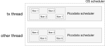
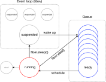

# Файберы, потоки и многозадачность

## Общие сведения {: #intro }

Данный раздел содержит описание модели кооперативной многозадачности в
Picodata. Эти сведения помогут разработчикам создавать расширения для
Picodata на языке Rust.

См. также:

- [Tarantool internals — Fibers](https://www.tarantool.io/en/dev/core/fiber/)
- [Tarantool — Fibers, yields, and cooperative multitasking](https://www.tarantool.io/en/doc/latest/concepts/coop_multitasking/)
- [Tarantool — C API Reference — Module fiber ](https://www.tarantool.io/en/doc/latest/dev_guide/reference_capi/fiber/)

## Файберы и устройство потоков {: #fibers_threads }

Внутри основного процесса `picodata` существует несколько потоков ОС:

- `tx thread` — основной поток для выполнения SQL-команд и в целом логики,
  связанной с действиями пользователя. `tx thread` большую часть времени
  выполняется на одном и том же ядре ЦП, редко совершает операции
  ввода/вывода (I/O) и, соответственно, реже привлекает внимание
  планировщика ОС
- некоторое количество вспомогательных потоков (например, WAL, поток
  репликации и т.д.), в большей степени связанных с операциями
  ввода/вывода накопителя или сети

<!--
Потоки ОС, содержащие в себе планировщик (реализация event loop с помощью
библиотеки `libev`), на языке разработчиков называются кордами (cord).
-->

Понятие [файбера][fiber] относится к реализации кооперативной
многозадачности в Picodata, т.е. к возможности выполнять асинхронно
несколько операций внутри одного потока ОС.

_Файберы_ — наборы инструкций, которые также называются _легковесными
потоками_, выполняющимися внутри `tx thread` и остальных потоков.
Активность в СУБД происходит в виде сменяющих друг друга файберов,
которые выполняются асинхронно и под управлением внутреннего
планировщика Picodata:

Все события внутри `tx thread` основаны не неблокирующих системных
вызовах, за которыми следит `libev`. Таким образом, в рамках `tx
thread`, Picodata является однопоточной СУБД с собственным легковесным
планировщиком. Это обеспечивает лучшую управляемость и решает проблемы,
связанные с распределенной природой СУБД.

Каждый файбер исполняет определенный набор инструкций. Как правило, это
отдельная полезная функция, например установка сетевого подключения,
исполнение пользовательской SQL-команды и т.д. Выполнив свою функцию,
файбер инициирует событие [переключения](#yields) — и в этот момент
меняет свое состояние.

[fiber]: ../overview/glossary.md#fiber

## Состояния файбера {: #fiber_states }

Любой запущенный файбер может быть в одном из следующих состояний:

- _running_ — исполняется
- _suspended_  — приостановлен в ожидании какого-то события
- _ready_ — готов продолжить работу
- _dead_ — завершен

В каждый момент времени в состоянии _running_ может находиться не более 1 файбера.

## Жизненный цикл файбера {: #fiber_lifecycle }

Процесс исполнения кода с учетом передачи управления между файберами
показан на схеме ниже.

## Переключения (yields) {: #yields }

Переключением мы называем особое событие в контексте кооперативной
многозадачности, при котором управление внутри потока переходит от
одного файбера к другому (последний должен быть в состоянии _ready_).

### Передача управления между файберами {: #yielding_fibers }

Инициатором переключения всегда выступает сам файбер, в коде которого
для этого происходит вызов соответствующей функции. В этот момент
текущий файбер изменяет свое состояние на _suspended_ или _ready_, а
следующий файбер переходит из состояния _ready_ в состояние _running_.

При передаче управления используется первым в очереди файбер в состоянии
_ready_. Если очередь из таких файберов заканчивается, управление
возвращается циклу событий (_event loop_).

### Избегание блокировок переключения и голодания {: #starvation }

Если файбер не передает управление другим файберам в течение долгого
времени, это приводит к голоданию (starvation) остальных файберов. Они
не смогут продолжить работу и вызовут увеличение latency вплоть до
полного зависания инстанса. Гарантированно выйти из ситуации зависания
можно путем перезагрузки инстанса.
