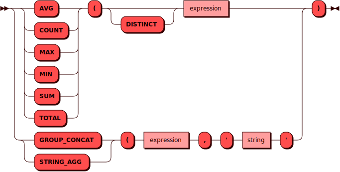

# Агрегатные функции

Агрегатная функция используется в [DQL](dql.md)-командах для получения
единственного результата из набора входных значений.

## Синтаксис {: #syntax }



### Выражение {: #expression }

<details><summary>Диаграмма</summary><p>

</p></details>

### Литерал {: #literal }

<details><summary>Диаграмма</summary><p>

</p></details>

## Функции {: #functions }

Поддерживаются следующие агрегатные функции:

* **AVG** — среднее значение;
* **COUNT** — количество значений в колонке;
* **MIN** — минимальное значение;
* **MAX** — максимальное значение;
* **SUM** — сумма значений (если строк нет, возвращает `null`);
* **TOTAL** — сумма значений (если строк нет, возвращает `0`);
* **GROUP_CONCAT** — соединяет строковые значения выражений с помощью
  разделителя.

## Примеры {: #examples }

Подсчет общего числа товаров на складе:

```sql
SELECT SUM(stock) FROM assets;
```

Получение строки из имен, соединенных через запятую:

```sql
SELECT GROUP_CONCAT(name, ', ') FROM characters;
```

Вывод в консоль:

```
---
- metadata:
  - {'name': 'COL_1', 'type': 'string'}
  rows:
  - ['Woody, Buzz Lightyear, Bo Peep, Mr. Potato Head, Slinky Dog, Barbie, Daisy, Forky,
      Dragon, The Dummies']
...
```
