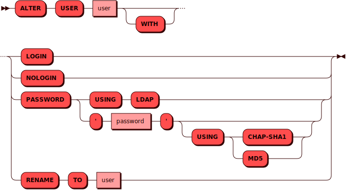

# ALTER USER

[DCL](dcl.md)-команда `ALTER USER` используется для изменения параметров существующего
пользователя.

## Синтаксис {: #syntax }



## Параметры {: #params }

* **USER** — имя пользователя. Соответствует правилам имен для всех [объектов](object.md)
  в кластере.

* **LOGIN** — разрешение на подключение к системе. Может применяться для
  снятия автоматической блокировки пользователя в связи с превышением
  макcимального количества неудачных попыток аутентификации.

* **NOLOGIN** — запрет на подключение к системе.

* **PASSWORD** — пароль пользователя может использовать русские и английские буквы во всех
  регистрах, а так же цифры и основные знаки препинания из
  [таблицы ASCII](https://ru.wikipedia.org/wiki/ASCII#Структурные_свойства_таблицы).

* **CHAP-SHA1** — аутентификация пользователя с помощью `chap-sha1`. Требуется использовать
  пароль не короче 8 символов.

* **LDAP** — аутентификация пользователя с помощью `ldap`. Пароль не используется и его длина
  не проверяется (пароль оставляется пустым для этого типа аутентификации).

* **MD5** — аутентификация пользователя с помощью `md5`. Требуется использовать пароль не
  короче 8 символов.

* **RENAME TO** — переименование пользователя.

## Примеры {: #examples }

Изменение пароля и метода аутентификации:

```sql
ALTER USER andy WITH PASSWORD 'Str0ng_P@ssw0rd' USING chap-sha1
OPTION (TIMEOUT = 3.0);
```

Изменение метода аутентификации на `LDAP`:
```sql
ALTER USER andy WITH PASSWORD '' USING LDAP
```

Блокировка пользователя:

```sql
ALTER USER andy WITH NOLOGIN;
```

Разблокировка пользователя (в том числе и автоматически заблокированного):

```sql
ALTER USER andy WITH LOGIN;
```

Переименование пользователя:

```sql
ALTER USER andy RENAME TO sid;
```
