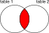
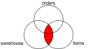

# Использование JOIN {: #join }

JOIN представляет собой параметр, используемый при SELECT-запросах с
целью получения данных из двух или более таблиц. Данный параметр
позволяет соединять колонки таблиц по заданному условию (оператор `ON`)
и тем самым создавать новую результирующую таблицу из указанных столбцов
изначальных таблиц. Соединение таблиц производится с использованием
перекрестного (декартова) произведения их кортежей (строк).

См. также:

- [SELECT](select.md)

## Расположение таблиц {: #join_tables }

Запрос с соединением всегда подразумевает наличие _внешней_ таблицы, а
также одной или нескольких _внутренних_ таблиц. Внешняя таблица
находится слева от параметра `JOIN`, а внутренние — справа.

Соединение таблиц всегда производится последовательно, в порядке,
указанном в запросе:

```sql
"table1" JOIN "table2" JOIN "table3" -> ("table1" JOIN "table2") JOIN "table3"
```

## Типы соединения {: #join_types }

Picodata поддерживает два типа соединения: `INNER JOIN` и `LEFT JOIN`.

### INNER JOIN {: #inner_join }

`INNER JOIN` — внутреннее соединение. Используется по умолчанию в тех
случаях, когда в запросе указан параметр `JOIN` без уточнения.

<div align="center">

</div>

Данный тип означает, что к колонкам каждого кортежа из внутренней
(правой) части запроса присоединяются только колонки тех кортежей
внешней (левой) части, которые удовлетворяют условию соединения `ON`.
Если во внешней части не нашлось подходящего кортежа, то внутренний
кортеж не попадает в результат.

### LEFT JOIN {: #left_join }

`LEFT JOIN ` / `LEFT OUTER JOIN `— внешнее левое соединение.

<div align="center">

</div>

Данный тип означает, что к колонкам каждого кортежа из внешней (левой)
части запроса присоединяются только колонки тех кортежей внутренней
(правой) части, которые удовлетворяют условию соединения `ON`. Если во
внутренней части не нашлось подходящего кортежа, то вместо значений
его колонок будет подставлен `NULL`.

## Условия соединения {: #join_condition }

Условие соединения позволяет сопоставить строки разных таблиц и является
обязательным для запросов со любым типом JOIN. Условие следует после
ключевого слова `ON` и, в большинстве случаев, соответствует одному из
следующих типов:

- равенство колонок (`characters.id = assets.id`)
- математическое выражение (`characters.id > 2`)
- литерал (`TRUE` / `FALSE`)

Любое соединение с JOIN является декартовым произведением кортежей из
внешней и внутренней таблицы с фильтрацией по условию соединения.
Поэтому результирующая таблица может быть как максимально возможного
размера (например, при условии `ON TRUE` будут взаимно перемножены _все_
кортежи), так и некоторого меньшего размера, в зависимости от заданного
условия.

См. также:

- [Выражение (expression)](select.md#expression)

## Примеры запросов {: #join_examples }

Разница между левым и внутренним соединением проявляется в случаях,
когда для части кортежей внешней таблицы отсутствуют подходящие под
условие соединения кортежи из внутренней таблицы. При внутреннем
соединении они будут отфильтрованы, при левом внешнем — оставлены, но на
месте отсутствующих значений будет `nil`.

Покажем это на примере соединения по равенству колонок для таблиц
`characters` и `assets`:

<details><summary>Содержимое таблиц</summary><p>

```sql
picodata> select * from "characters"
+----+-------------------+------+
| id | name              | year |
+===============================+
| 1  | "Woody"           | 1995 |
|----+-------------------+------|
| 2  | "Buzz Lightyear"  | 1995 |
|----+-------------------+------|
| 3  | "Bo Peep"         | 1995 |
|----+-------------------+------|
| 4  | "Mr. Potato Head" | 1995 |
|----+-------------------+------|
| 5  | "Woody"           | 1995 |
|----+-------------------+------|
| 10 | "Duke Caboom"     | 2019 |
+----+-------------------+------+
(6 rows)
picodata> select * from "assets"
+----+------------------+-------+
| id | name             | stock |
+===============================+
| 1  | "Woody"          | 2561  |
|----+------------------+-------|
| 2  | "Buzz Lightyear" | 4781  |
+----+------------------+-------+
(2 rows)
```
</p></details>

Пример левого соединения:

```sql
SELECT "characters"."name", "characters"."year", "assets"."stock"
FROM "characters"
LEFT JOIN "assets"
ON "characters"."id" = "assets"."id"
```

Результат:

```shell
+-------------------+-----------------+--------------+
| characters.name   | characters.year | assets.stock |
+====================================================+
| "Woody"           | 1995            | 2561         |
|-------------------+-----------------+--------------|
| "Buzz Lightyear"  | 1995            | 4781         |
|-------------------+-----------------+--------------|
| "Bo Peep"         | 1995            | nil          |
|-------------------+-----------------+--------------|
| "Mr. Potato Head" | 1995            | nil          |
|-------------------+-----------------+--------------|
| "Woody"           | 1995            | nil          |
|-------------------+-----------------+--------------|
| "Duke Caboom"     | 2019            | nil          |
+-------------------+-----------------+--------------+
(6 rows)
```

Пример внутреннего соединения:

```sql
SELECT "characters"."name", "characters"."year", "assets"."stock"
FROM "characters"
INNER JOIN "assets"
ON "characters"."id" = "assets"."id"
```

Результат:

```shell
+------------------+-----------------+--------------+
| characters.name  | characters.year | assets.stock |
+===================================================+
| "Woody"          | 1995            | 2561         |
|------------------+-----------------+--------------|
| "Buzz Lightyear" | 1995            | 4781         |
+------------------+-----------------+--------------+
(2 rows)
```

## Множественные соединения {: #multiple_joins }

Соединять можно не только две, но и большее число таблиц. В запросе с
несколькими соединениями могут быть использованы разные комбинации
левого и внутреннего соединения.

Для примера с двумя соединениями задействуем третью тестовую таблицу.

<details><summary>Содержимое таблицы</summary><p>

```sql
picodata> select * from "cast"
+------------------+---------------+-------------+
| character        | actor         | film        |
+================================================+
| "Bo Peep"        | "Annie Potts" | "Toy Story" |
|------------------+---------------+-------------|
| "Buzz Lightyear" | "Tim Allen"   | "Toy Story" |
|------------------+---------------+-------------|
| "Woody"          | "Tom Hanks"   | "Toy Story" |
+------------------+---------------+-------------+
(3 rows)
```
</details>

Сделаем соединение трех таблиц с тем, чтобы узнать актеров всех
персонажей из `characters` независимо от того, есть ли для
соответствующих игрушек данные об остатках на складе.

<p align="center">

</p>

Запрос:

```sql
SELECT "characters"."name", "assets"."stock", "cast"."actor"
FROM "characters"
LEFT JOIN "assets"
ON "characters"."id" = "assets"."id"
JOIN "cast"
ON "characters"."name" = "cast"."character"
```

Результат:

```shell
+------------------+--------------+---------------+
| characters.name  | assets.stock | cast.actor    |
+=================================================+
| "Woody"          | 2561         | "Tom Hanks"   |
|------------------+--------------+---------------|
| "Buzz Lightyear" | 4781         | "Tim Allen"   |
|------------------+--------------+---------------|
| "Bo Peep"        | nil          | "Annie Potts" |
|------------------+--------------+---------------|
| "Woody"          | nil          | "Tom Hanks"   |
+------------------+--------------+---------------+
(4 rows)
```

## Перемещение данных {: #join_motions }

При выполнении распределенного запроса, соединение таблиц может
сопровождаться полным или частичным перемещением данных, либо не
требовать перемещения данных совсем. Критерием здесь выступает условие
соединения (`ON`).

При необходимости перемещения данных, в план выполнения запроса перед
сканированием внутренней таблицы добавляется motion-узел, который
обеспечивает перекачку недостающих данных на бакеты, содержащие данные
внешней таблицы.

См. также:

- [EXPLAIN и варианты перемещения данных](explain.md#data_motion_types)

### Отсутствие перемещения {: #no_motion }

Перемещение данных не происходит, если в условии соединения использовано
равенство колонок, которые входят в ключи распределения соответствующих
таблиц.

К примеру, в условии соединения указано `ON "characters"."id" =
"assets"."id"`, и таблицы "characters" и "assets" обе распределены по
своим колонкам "id":

```sql
picodata> EXPLAIN SELECT "characters"."name", "characters"."year", "assets"."stock"
FROM "characters"
LEFT JOIN "assets"
ON "characters"."id" = "assets"."id"
projection ("characters"."name"::string -> "name", "characters"."year"::integer -> "year", "assets"."stock"::integer -> "stock")
    left join on ROW("characters"."id"::integer) = ROW("assets"."id"::integer)
        scan "characters"
            projection ("characters"."id"::integer -> "id", "characters"."name"::string -> "name", "characters"."year"::integer -> "year")
                scan "characters"
        scan "assets"
            projection ("assets"."id"::integer -> "id", "assets"."name"::string -> "name", "assets"."stock"::integer -> "stock")
                scan "assets"
```

### Частичное перемещение {: #segment_motion }

Частичное перемещение означает, что недостающая часть внутренней таблицы
должна быть скопирована на узлы, содержащие данные внешней таблицы.

К примеру, в условии соединения указано `ON "characters"."id" =
"assets"."id"`, но таблица "characters" распределена по колонке "id", а
"assets" — по какой-то другой колонке:

```sql
picodata> EXPLAIN SELECT "characters"."name", "characters"."year", "assets"."stock"
FROM "characters"
LEFT JOIN "assets"
ON "characters"."id" = "assets"."id"
projection ("characters"."name"::string -> "name", "characters"."year"::integer -> "year", "assets2"."stock"::integer -> "stock")
    left join on ROW("characters"."id"::integer) = ROW("assets"."id"::integer)
        scan "characters"
            projection ("characters"."id"::integer -> "id", "characters"."name"::string -> "name", "characters"."year"::integer -> "year")
                scan "characters"
        motion [policy: segment([ref("id")])]
            scan "assets"
                projection ("assets"."id"::integer -> "id", "assets"."name"::string -> "name", "assets"."stock"::integer -> "stock")
                    scan "assets"
```

### Полное перемещение {: #full_motion }

Полное перемещение означает, что вся внутренняя таблица
должна быть скопирована на узлы, содержащие данные внешней таблицы.

Такая ситуация возникает, если в условии соединения указана колонка
внешней таблицы, не входящая в ее ключ распределения.

К примеру, в условии соединения указано `ON "characters"."id" =
"assets"."id"`, но таблица "characters" распределена по какой-то другой
колонке, в то время как "assets" распределена по "id":

```sql
picodata> EXPLAIN SELECT "characters"."name", "characters"."year", "assets"."stock"
FROM "characters"
LEFT JOIN "assets"
ON "characters"."id" = "assets"."id"
projection ("characters"."name"::string -> "name", "characters"."year"::integer -> "year", "assets"."stock"::integer -> "stock")
    left join on ROW("characters"."id"::integer) = ROW("assets"."id"::integer)
        scan "characters"
            projection ("characters"."id"::integer -> "id", "characters"."name"::string -> "name", "characters"."year"::integer -> "year")
                scan "characters"
        motion [policy: full]
            scan "assets"
                projection ("assets"."id"::integer -> "id", "assets"."name"::string -> "name", "assets"."stock"::integer -> "stock")
                    scan "assets"
```

Также, при использовании математических выражений или литералов, перемещение всегда будет полным:

```sql
picodata> EXPLAIN SELECT "characters"."name", "characters"."year", "assets"."stock"
FROM "characters"
LEFT JOIN "assets"
ON "characters"."id" = 1
projection ("characters"."name"::string -> "name", "characters"."year"::integer -> "year", "assets"."stock"::integer -> "stock")
    left join on ROW("characters"."id"::integer) = ROW(1::unsigned)
        scan "characters"
            projection ("characters"."id"::integer -> "id", "characters"."name"::string -> "name", "characters"."year"::integer -> "year")
                scan "characters"
        motion [policy: full]
            scan "assets"
                projection ("assets"."id"::integer -> "id", "assets"."name"::string -> "name", "assets"."stock"::integer -> "stock")
                    scan "assets"
```

```sql
picodata> EXPLAIN SELECT "characters"."name", "characters"."year", "assets"."stock"
FROM "characters"
LEFT JOIN "assets"
ON TRUE
projection ("characters"."name"::string -> "name", "characters"."year"::integer -> "year", "assets"."stock"::integer -> "stock")
    left join on true::boolean
        scan "characters"
            projection ("characters"."id"::integer -> "id", "characters"."name"::string -> "name", "characters"."year"::integer -> "year")
                scan "characters"
        motion [policy: full]
            scan "assets"
                projection ("assets"."id"::integer -> "id", "assets"."name"::string -> "name", "assets"."stock"::integer -> "stock")
                    scan "assets"

```
