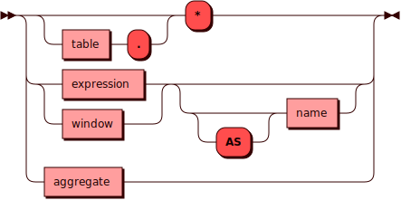

# SELECT

[DQL](dql.md)-команда `SELECT` используется для получения, фильтрации и
преобразования кортежей из таблиц в запросе. Если никакие данные не
удовлетворяют условиям фильтрации, то в ответе вернется только описание
метаданных колонок без самих кортежей. В контексте распределенной
системы, команда `SELECT` в Picodata получает информацию из всех частей
таблицы, которая может храниться на нескольких узлах кластера.

!!! note "Примечание"
    Кортежи в выводе идут в том порядке, в каком их
    отдают узлы Picodata. Гарантии порядка не предоставляются.

## Синтаксис {: #syntax }


### Проекция {: #projection }

<details><summary>Диаграмма</summary><p>

</p></details>

### Выражение {: #expression }

<details><summary>Диаграмма</summary><p>

</p></details>

### Литерал {: #literal }

<details><summary>Диаграмма</summary><p>

</p></details>

## Параметры {: #params }

* **Псевдоним** — позволяет переопределить названия получаемых столбцов
в запросах. Псевдоним вставляется после опционального слова `AS` и может
содержать произвольный текст со следующими ограничениями: он не должен
начинаться с цифры и не может содержать пробелов и специальных служебных
символов (кроме знака подчеркивания).

* **DISTINCT** — возвращаются только уникальные значения кортежей.

* **INNER JOIN** — к колонкам каждого кортежа из внутренней (правой)
  части запроса присоединяются только колонки тех кортежей внешней
  (левой) части, которые удовлетворяют условию соединения `ON`. Если во
  внешней части не нашлось подходящего кортежа, то внутренний кортеж не
  попадает в результат.

* **LEFT OUTER JOIN** — к колонкам каждого кортежа из внешней (левой)
  части запроса присоединяются только колонки тех кортежей внутренней
  (правой) части, которые удовлетворяют условию соединения `ON`. Если во
  внутренней части не нашлось подходящего кортежа, то вместо значений
  его колонок будет подставлен `NULL`.

* **WHERE** — условие фильтрации при сканировании таблицы или
  подзапроса.

* **GROUP BY** — [группировка](aggregate.md) данных по списку колонок
  или выражений.

* **HAVING** — фильтрация уже сгруппированных данных.

* **ORDER BY** — сортировка результата запроса по одной или нескольким
  колонкам. Используется для упорядочивания получаемого набора данных.
  Колонки могут быть указаны как по их именам, так и по порядковым
  номерам. Если не указан тип упорядочивания (`ASC` — по возрастанию,
  `DESC` — по убыванию), то по умолчанию подразумевается возрастание
  значений.

* **UNION ALL** — объединение результатов с одинаковым набором колонок
  из нескольких DQL запросов. При этом результат может содержать
  дубликаты строк. На текущий момент грамматика SQL не поддерживает
  несколько `UNION ALL` подряд. Чтобы обойти это ограничение, следует
  воспользоваться подзапросами.

* **EXCEPT DISTINCT** — исключение результатов с одинаковым набором
  колонок одного запроса из другого. При этом результат не содержит
  дубликаты строк. На текущий момент грамматика SQL не поддерживает
  несколько `EXCEPT DISTINCT` подряд. Чтобы обойти это ограничение,
  следует воспользоваться подзапросами.

См. также:

- [Использование JOIN](join.md)

## Примеры  {: #examples }

Получение данных из таблицы с фильтрацией:

```sql
SELECT type FROM characters WHERE name = 'Woody';
```

Получение данных без повторов:

```sql
SELECT DISTINCT type FROM characters;
```

Внутреннее соединение:

```sql
SELECT
    c.name,
    a.stock
FROM characters as c
JOIN assets AS a
ON c.id = a.id;
```

Внешнее левое соединение:

```sql
SELECT
    c.name,
    a.stock
FROM characters as c
LEFT JOIN assets AS a
ON true;
```

Множественные соединения:

```sql
SELECT characters.name, cast.film, cast.actor, stars.age
FROM characters
INNER JOIN cast ON characters.name = cast.character
LEFT OUTER JOIN stars ON cast.actor = stars.name;
```

Агрегация:

```sql
SELECT COUNT(*) FROM characters WHERE id < 10;
```

Группировка с предварительной фильтрацией:

```sql
SELECT type, COUNT(*) FROM characters
WHERE id < 10
GROUP BY type;
```

Группировка с последующей фильтрацией по сгруппированным данным:

```sql
SELECT type, COUNT(*) as c FROM characters
GROUP BY type
HAVING c > 10
```

Упорядочивание результата по убыванию значений в третьей колонке:

```sql
SELECT * FROM item
ORDER BY 3 DESC
```

Разнонаправленное упорядочивание результата по двум явно именованным
колонкам:

```sql
SELECT * FROM item
ORDER BY name ASC, stock DESC
```

Объединение результатов нескольких запросов:

```sql
SELECT name FROM characters WHERE name = 'Dragon'
UNION ALL
SELECT * FROM (
    SELECT name FROM assets
    UNION ALL
    SELECT name FROM characters WHERE name = 'Woody'
)
```

Последовательное исключение результатов для нескольких запросов:

```sql
SELECT name FROM characters
EXCEPT
SELECT * FROM (
    SELECT name FROM assets
    EXCEPT
    SELECT name FROM characters WHERE name = 'Woody'
)
```
