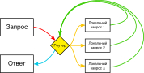

# Принципы работы распределенного SQL
Распределенные SQL-запросы в Picodata работают благодаря интегрированной
динамической библиотеке SQL Broadcaster, которая работает на всех
экземплярах Tarantool в кластере. SQL-запросы выполняются на узлах,
исполняющих роль маршрутизаторов (роутеров), и получают данные с узлов
хранения (storages). Поскольку в кластере может быть много как узлов
хранения, так и роутеров, каждый распределенный запрос разбивается на
части для опроса всех узлов. Собранные данные затем консолидируются и
возвращаются пользователю. 

На схеме ниже показан общий принцип работы распределенного SQL-запроса в
кластере с одним роутером.

На схеме _красным_ показан исходный
пользовательский запрос, _желтым_ —
план запроса (IR, intermediate representation), _зеленым_ — собранные фрагменты ответов,
_голубым_ — консолидированный ответ
на пользовательский запрос в виде списка кортежей, обработанного
функцией MapReduce.

Распределенный SQL требует собственно распределения данных между
различными репликасетами (шардами) кластера. Это достигается за счет
задействования библиотеки [Vshard](../glossary.md#vshard). Взаимодействие SQL
Broadcaster и Vshard заключается в разделении функций:

- SQL Broadcaster работает со [спейсами](../glossary.md#space)
  (таблицами), отдельные строки (кортежи) которых распределяются по
  разным [бакетам](../glossary.md#bucket);
- Vshard работает с распределением бакетов по
  [репликасетам](../glossary.md#replicaset).

У каждого распределенного спейса в схеме данных всегда есть два признака:

- наличие столбца `bucket_id`, связывающего каждую строку спейса с
  определенным номером бакета;
- наличие ключа шардирования, состояшего минимум из одного столбца, по
  которому производится расчет значения `bucket_id`.

SQL Broadcaster включает внутреннюю функцию по вычислению `bucket_id` на
основе хешей значений, которые передаются в распределенных запросах. В
шардированном спейсе `bucket_id` хранит вычисленное значение (номер
бакета) от функции шардирования (на вход подается набор колонок, по
которым происходит шардирование, и количество бакетов в кластере). Для
запроса `SELECT` значение `bucket_id` нужно чтобы узел с ролью
`vshard.router` мог понять, на каком узле с ролью `vshard.storage`
расположены искомые данные. Соответственно, для запроса `INSERT`
требуется знать, на какой узел записывать данные. В общем случае, две
записи с одинаковыми значениями в столбцах, относящихся к
`sharding_key`, попадут в один бакет.

Описание поддерживаемых запросов и их синтаксиса приведены в разделе:
[Команды SQL](../sql_queries)

---
[Исходный код страницы](https://git.picodata.io/picodata/picodata/docs/-/blob/main/docs/sbroad/sql_review.md)
