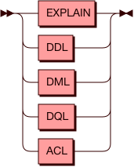
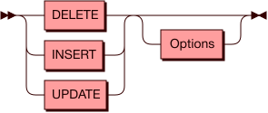
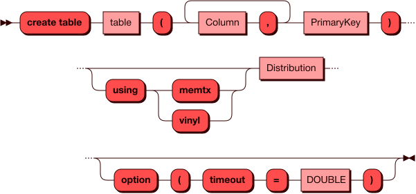
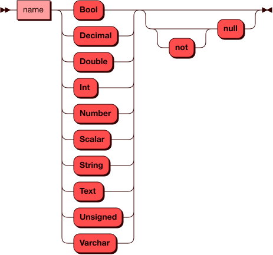
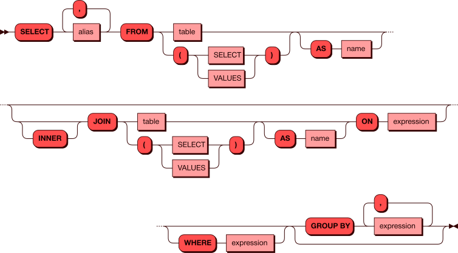
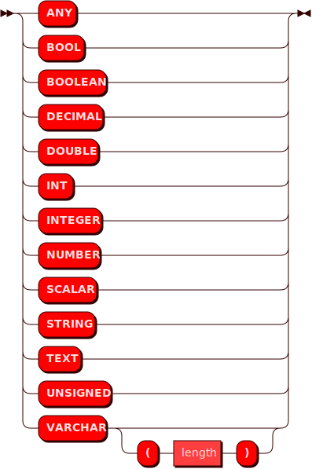
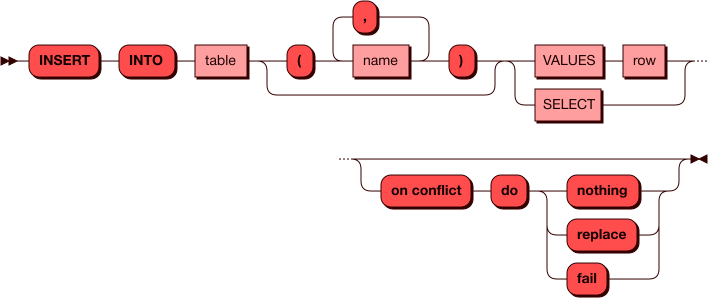

# Команды SQL
Данный справочник предоставляет основные варианты использования команд SQL в
Picodata при работе с распределенной СУБД.

## Поддерживаемые функции
Возможности SQL в Picodata включают следующие функции:

- Data Definition Language (`DDL`): команды для
  [создания](#create_space) и [удаления](#drop_space)
  [спейсов](../glossary.md#space);
- Data Modification Language (`DML`): команды [`INSERT`](#insert) для
  добавления данных в спейсы и [`DELETE`](#delete) для удаления данных;
- Data Query Language (`DQL`): команда [`SELECT`](#select) для получения
  данных из спейсов;
- команда [`EXPLAIN`](#explain) для отображения планов запросов `DML` и
  `DQL`.

Схемы этих функций на вернем уровне показаны ниже:

### **STATEMENT**


#### **DML**


#### **DQL**


#### **DDL**


Ниже приведены особенности синтаксиса команд и дано описание часто используемых
команд с примерами их выполнения.

## Начало работы
Для начала работы с командами SQL требуется интерактивная консоль
Picodata. Она доступна после [запуска](../glossary.md#run) инстанса или
явного [подключения](../glossary.md#connect) к нему. Синтаксис команд
учитывает особенности Lua-интерпретатора консоли и предполагает, что
любой SQL-запрос должен содержаться в обертке следующего вида:

```
pico.sql([[запрос]], {значения передаваемых параметров})
```

## Создание спейса <a name="create_space"></a>

Схема запроса для создания шардированного спейса показана ниже.

### **CreateTable**


#### **Column**


#### **PrimaryKey**


#### **Distribution**


#### **Option**


Для примера в этом разделе будем использовать два тестовых спейса для учета
персонажей из "Истории игрушек":

- `characters` — список персонажей с указанием года выхода на экран;
- `assets` — список соответствующих игрушек с указанием их остатков на складе.


Создадим первый спейс следующей командой:

```
pico.sql([[
	create table "characters" (
    	        "id" integer,
              "name" text not null,
    	        "year" integer,
    	        primary key ("id")
	) using memtx distributed by ("id")
	option (timeout = 3.0)
]])
```

Для второго спейса команда будет отличаться только именем третьей колонки.

При создании таблицы можно выбрать один из доступных движков хранения данных:

  - `memtx` — движок для хранения вех данных в ОЗУ (in-memory);
  - `vinyl` — дисковый движок хранения данных, использующий LSM-деревья
    (Log Structured Merge Tree).

## Удаление спейса <a name="drop_space"></a>

Cхема запроса для удаления спейса показана ниже:

### **DropTable**


Пример даления спейса:

```
pico.sql([[
	drop table "characters"
]])
```

## Запрос SELECT <a name="select"></a>

Запрос `SELECT` используется для получения информации из указанной
таблицы в базе данных. Он возвращает 0 или более строк из таблицы
согласно поисковому запросу. В контексте распределенной системы, запрос
`SELECT` в Picodata получает информацию из всех сегментов таблицы,
которая может храниться на нескольких узлах кластера. В Picodata
источником данных для запроса `SELECT` может выступать таблица, строка
значений или другой подзапрос. Также можно соединять несколько запросов
одного уровня вместе. Внутри запроса значения имен полей (например,
имена колонок) не должны дублироваться.

Cхема возможных распределенных запросов `SELECT` показана ниже.

### **SELECT**


### Примеры запросов

Пример получения данных всей таблицы:

```
pico.sql([[select * from "characters"]], {})
```

Вывод в консоль:

```
---
- metadata:
  - {'name': 'id', 'type': 'integer'}
  - {'name': 'name', 'type': 'string'}
  - {'name': 'year', 'type': 'integer'}
  rows:
  - [1, 'Woody', 1995]
  - [2, 'Buzz Lightyear', 1995]
  - [3, 'Bo Peep', 1995]
  - [4, 'Mr. Potato Head', 1995]
  - [5, 'Slinky Dog', 1995]
  - [6, 'Barbie', 2010]
  - [7, 'Daisy', 2010]
  - [8, 'Forky', 2019]
  - [9, 'Dragon', 2019]
  - [10, 'The Dummies', 2019]
...
```

_Примечание_: строки в выводе идут в том порядке, в каком их отдают узлы
хранения Picodata.

В читающих запросах с условиями можно использовать как обычный вид, так
и параметризированный. Например, следующие две команды дадут одинаковый
результат (вывод строки по известному `id`):

```
pico.sql([[select "name" from "characters" where "id" = 1]], {})
```

```
pico.sql([[select "name" from "characters" where "id" = ?]], {1})
```

Вывод в консоль:

```
---
- metadata:
  - {'name': 'name', 'type': 'string'}
  rows:
  - ['Woody']
...
```

Разница состоит в том, что при параметризации происходит кеширование
плана запроса по ключу от шаблона SQL (в данном случае `select "name"
from "characters" where "id" = ?`), и если подобных запросов несколько, то
они все смогут использовать кешированный план. Без параметризации у
каждого запроса будет свой отдельный план, и ускорения от кеша не
произойдет.

Пример вывода строк по нескольким условиям для разных столбцов (также
два варианта):

```
pico.sql([[select "name","year" from "characters" where "id" > 3 and "year" > 2000 ]], {})
```

```
pico.sql([[select "name","year" from "characters" where "id" > ? and "year" > ? ]], {3, 2000})
```

Вывод в консоль:

```
---
- metadata:
  - {'name': 'name', 'type': 'string'}
  - {'name': 'year', 'type': 'integer'}
  rows:
  - ['Barbie', 2010]
  - ['Daisy', 2010]
  - ['Forky', 2019]
  - ['Dragon', 2019]
  - ['The Dummies', 2019]
...
```

Структурно SQL-запрос состоит из трех частей:

1. То, что требуется получить
2. Разделяющий оператор `from`
3. Оставшаяся часть запроса, которая логически представляет собой одну
   сущность и может включать как простое указание на таблицу, так и
   конструкцию из разных условий.

### Параметризированные запросы

### **values**


### **row**


### **column**


### **expression**


### **reference**


### **value**


### **type**


## Использование агрегатных функций <a name="aggregate"></a>
Поддерживаются следующие агрегатные функции для работы с колонками:

- `COUNT`, количество значений в колонке;
- `SUM`, сумма значений в колонке (если строк нет, возвращает `null`);
- `AVG`, среднее значение в колонке;
- `TOTAL`, сумма значений в колонке (если строк нет, возвращает `0`);
- `MIN`, минимальное значение в колонке;
- `MAX`, максимальное значение в колонке;
- `GROUP_CONCAT` [`"column_name"`, `'string'`], добавляет к каждому
  значению колонки `column_name` указанное значение `string`.

Пример подсчета общего числа товаров на складе:

```
pico.sql([[select sum("stock") from "assets"]], {})
```

Вывод в консоль:

```
---
- metadata:
  - {'name': 'COL_1', 'type': 'decimal'}
  rows:
  - [10536]
...
```

Пример добавления текста к значениям в колонке:

```
pico.sql([[select group_concat("name",' character, ') from "characters"]], {})
```

Вывод в консоль:

```
---
- metadata:
  - {'name': 'COL_1', 'type': 'string'}
  rows:
  - ['Woody character, Buzz Lightyear character, Bo Peep character, Mr. Potato Head
      character, Slinky Dog character, Barbie character, Daisy character, Forky character,
      Dragon character, The Dummies']
...
```

## Использование VALUES
Команда `VALUES` представляет собой конструктор строки значений для
использования в запросе `SELECT`. В некотором смысле, передаваемые с
`VALUES` значения являются временной таблицей, которая существует только
в рамках запроса. Использовать `VALUES` имеет смысл тогда, когда
требуется получить набор строк, для которых известны значения одного или
более столбцов. Например, с помощью команды ниже можно выяснить название
игрушки, зная ее количество на складе:

```
pico.sql([[select "name" from "assets" where ("stock") in (values (2561))]], {})
```

Вывод в консоль:

```
---
- metadata:
  - {'name': 'name', 'type': 'string'}
  rows:
  - ['Woody']
...
```

## Использование UNION ALL <a name="union_all"></a>
Команда `UNION ALL` используется для соединения результатов нескольких
запросов. Это может быть полезно для объединения данных из нескольких
таблиц, или для удобного отображения разных вычислений или манипуляций
со строками таблицы. Результат запроса может содержать дублирующиеся строки.

Для примера предположим, что требуется получить список игрушек с
персонажами 1995 года, а также все игрушки, остатки которых на складе
превышают 1000 штук:

```
pico.sql([[
  select "name" 
  from "characters" 
  where "year" = 1995 
  union all 
  select "name" from "assets" 
  where "stock" > 1000
]], {})
```

Вывод в консоль:

```
---
- metadata:
  - {'name': 'name', 'type': 'string'}
  rows:
  - ['Woody']
  - ['Buzz Lightyear']
  - ['Bo Peep']
  - ['Mr. Potato Head']
  - ['Slinky Dog']
  - ['Woody']
  - ['Buzz Lightstock']
  - ['Slinky Dog']
...
```

## Использование EXCEPT
Команда `EXCEPT` используется для соединения нескольких запросов
`SELECT` по принципу исключения. Это означает, к примеру, что из
результата первого запроса будут исключены результаты второго, если
между ними есть пересечение. `EXCEPT` может применяться при запросах из
разных таблиц, либо разных столбцов одной таблицы, когда нужный
результат нельзя получить лишь одним SELECT-запросом.

Используем команду, похожую на предыдущий пример, но с другим смыслом.
На этот раз нужно получить список игрушек с персонажами 1995 года, но
только если их запасы меньше 1000 штук: 

```
pico.sql([[select "name"  from "characters" where "year" = 1995 except select "name" from "assets" where "stock" > 1000]], {})
```

Вывод в консоль:

```
---
- metadata:
  - {'name': 'name', 'type': 'string'}
  rows:
  - ['Bo Peep']
  - ['Buzz Lightyear']
  - ['Mr. Potato Head']
...
```

## Использование псевдонимов
Использование псевдонимов (aliases) позволяет переопределить названия
получаемых столбцов в SELECT-запросах. Псевдоним вставляется после
ключевого слова `AS` и может содержать произвольный текст со следующими
ограничениями: он не должен начинаться с цифры и не может содержать
пробелов и специальных служебных символов (кроме знака подчеркивания).

Пример для вывода столбцы таблицы:

```
pico.sql([[select "score" as "Total_score" from "scoring"]], {})
---
- metadata:
  - {'name': 'Total_score', 'type': 'decimal'}
  rows:
  - [78.33]
  - [84.61]
  - [47.28]
...
```

Пример для функции `CAST()`:

```
pico.sql([[select sum(cast("score" as int)) as "_Total_score_1" from "scoring"]], {})
---
- metadata:
  - {'name': '_Total_score_1', 'type': 'decimal'}
  rows:
  - [209]
...
```

## Использование JOIN
Команда `JOIN` используется для комбинирования данных из нескольких
таблиц. Но, в отличие от `UNION ALL`, результатом будет объединение не
строк, а столбцов. Таким образом, если `UNION ALL` добавляет к строкам
одной таблицы строки другой (при условии совпадения типов данных в
соответствующих столбцах), то `JOIN` создает новую результирующую
таблицу из указанных столбцов этих таблиц. Использование `JOIN` полезно
для соединения связанных друг с другом данных из разных таблиц.
Склеивание столбцов требует указания условия (оператор `ON`). Для
примера создадим из двух таблицы выше новую результирующую таблицу, где
будут одновременно и остатки игрушек на складе, и годы выхода
соответствующих персонажей:


Команда:

```
pico.sql([[
  select
   "id","name","stock","year"
  from "characters" 
  join (
    select "id" as "number","stock" from "assets"
    ) as stock
    on "characters"."id" = stock."number"
]], {})
```

Вывод в консоль:

```
---
- metadata:
  - {'name': 'characters.id', 'type': 'integer'}
  - {'name': 'characters.name', 'type': 'string'}
  - {'name': 'STOCK.stock', 'type': 'integer'}
  - {'name': 'characters.year', 'type': 'integer'}
  rows:
  - [1, 'Woody', 2561, 1995]
  - [2, 'Buzz Lightyear', 4781, 1995]
  - [3, 'Bo Peep', 255, 1995]
  - [4, 'Mr. Potato Head', 109, 1995]
  - [5, 'Slinky Dog', 1112, 1995]
  - [6, 'Barbie', 998, 2010]
  - [7, 'Daisy', 66, 2010]
  - [8, 'Forky', 341, 2019]
  - [9, 'Dragon', 235, 2019]
  - [10, 'The Dummies', 78, 2019]
...
```

При использование после `JOIN` подзапроса (см. [схему](#select))
обязательно следует указать псевдоним (`AS`) для временной таблицы
подзапроса. С помощью дополнительных псевдонимов можно заменить
автоматические имена колонок в результирующей таблице на собственные.
Пример:

```
pico.sql([[
  select
    "id" as "id1",
    "name" as "name1",
    "stock" as "stock1",
    "year" as "year1"
  from "characters"
  join (
    select "id" as "number", "stock" from "assets"
  ) as stock
  on "characters"."id" = stock."number"
]], {})
```

Вывод в консоль:

```
---
- metadata:
  - {'name': 'id1', 'type': 'integer'}
  - {'name': 'name1', 'type': 'string'}
  - {'name': 'stock1', 'type': 'integer'}
  - {'name': 'year1', 'type': 'integer'}
  rows:
  - [1, 'Woody', 2561, 1995]
  - [2, 'Buzz Lightyear', 4781, 1995]
  - [3, 'Bo Peep', 255, 1995]
  - [4, 'Mr. Potato Head', 109, 1995]
  - [5, 'Slinky Dog', 1112, 1995]
  - [6, 'Barbie', 998, 2010]
  - [7, 'Daisy', 66, 2010]
  - [8, 'Forky', 341, 2019]
  - [9, 'Dragon', 235, 2019]
  - [10, 'The Dummies', 78, 2019]
...
```

Более того, использование псевдонимов может быть обязательным, если во
внутренней и внешней таблицах есть колонки с одинаковыми именами: так как
у реляционного оператора `JOIN` в плане будут в финальном кортеже все
колонки из этих таблиц, то их имена должны быть уникальными.

## Использование функции CAST()
Функция `CAST()` используется для изменения получаемого типа данных при
SELECT-запросах. С ее помощью можно преобразовать числа в текст, дробные
числа в целые и так далее согласно приведенной [выше](#type) схеме. В
частности, поддерживаются следующие типы данных: <a name="data_types"></a>

- `ANY`. Любой тип данных / тип данных не задан;
- `BOOL`, `BOOLEAN`. Логический тип данных, поддерживаемые значения:
  `FALSE`, `TRUE` и `NULL` (`UNKNOWN` в терминологии троичной логики).
  По правилам сравнения `FALSE` меньше `TRUE`.
- `DECIMAL`. Числа с фиксированной запятой, содержащие до 38 цифр;
- `DOUBLE` Числа с плавающей запятой стандарта IEEE 754. Помимо
  стандартной записи дробного числа (например, `0.5`) поддерживается и
  экспоненциальная форма (например, `5E-1`);
- `INT`, `INTEGER`. Целые числа в диапазоне от `-2^63` до `+2^64` или
  `NULL`;
- `NUMBER`. Универсальный числовой контейнер, в котором могут лежать как
  целые числа, так и числа с плавающей запятой;
- `SCALAR`. Скалярный тип данных, т.е содержащий только один элемент
  (_не_ кортеж и _не_ массив);
- `STRING`, `TEXT`. Текстовый тип данных. Позволяет хранить текстовую
  строку переменной длины. Максимальная длина составляет `2,147,483,647`
  байт;
- `UNSIGNED`. Тип целого беззнакового числа в диапазоне от `0` до
  `+2^64` или `NULL`.
- `VARCHAR`. Текстовый тип данных с явно заданной длиной строки.

### Пример запроса
В качестве примера покажем преобразование дробных чисел в целые с
отбрасыванием дробной части. Используем следующую таблицу:


В обычном виде значения столбца `score` имеют дробную часть и определены
в схеме данных типом `decimal`:

```
pico.sql([[select "score" from "scoring"]], {})
---
  'metadata': [
   {'name': 'score', 'type': 'decimal'}], 
  'rows': [
    [78.33],
    [84.61],
    [47.28]]
...

```
Преобразуем эти числа в `int`:

```
pico.sql([[select cast("score" as int) from "scoring"]], {})
---
  'metadata': [
  {'name': 'COL_1', 'type': 'integer'}],
  'rows': [
  [78],
  [84],
  [47]]
...
```

## Запрос INSERT <a name="insert"></a>
Команда `INSERT` используется для помещения (записи) строки данных в
таблицу. На данный момент атомарность записи гарантируется только для
одной строки в рамках одного запроса.

Схема возможных запросов `INSERT` показана ниже.



### Примеры запросов
Запись строки данных в таблицу командой `INSERT` возможна как в обычном
виде, так и в параметризированном. Пример параметризированной вставки
строки значений в таблицу:

```
pico.sql([[insert into "assets" ("id", "name", "stock") values (?, ?, ?)]], {1, "Woody", 2561})
```

Если вставляемая строка точно содержит значения для всех столбцов, то их
можно явно не указывать:

```
pico.sql([[insert into "assets" values (1, 'Woody', 2561)]], {})
```

Параметризация значений при `INSERT` влияет на тип данных при выполнении
запроса. Так, в обычном виде дробные числа конвертируются в числа с
фиксированной запятой (например, `values(2.5)` в `decimal 2.5`). В
параметризированном виде дробнному числу будет назначен типа с плавающей
запятой (например, `values(?), {2.5}` в `double 2.5`). См.
[подробнее](#data_types) о типах данных.

При использовании `INSERT` вместе с подзапросом (`SELECT`) происходит
кеширование подзапроса, поэтому его тоже имеет смысл параметризировать,
чтобы выиграть в скорости при выполнении последующих подобных запросов:

```
pico.sql([[insert into "assets" select * from "assets2" where "id2" = ?]], {11}
```

Результатом `INSERT` в приведенных примерах будет вывод в консоль
информации о количестве успешно вставленных строк:

```
---
- row_count: 1
...
```

### Обработка конфликтов
В некоторых случаях вставка строки может вернуть ошибку, например, при
попытке вставить строку с уже существующим индексом:

```
pico.sql([[insert into "characters" ("id", "name", "year") values (10, 'Duke Caboom', 2019)]], {})
---
- null
- 'sbroad: Lua error (IR dispatch): LuaError(ExecutionError("sbroad: failed to create
  transaction: RolledBack(FailedTo(Insert, Some(Space), \"TupleFound: Duplicate key
  exists in unique index \\\"primary_key\\\" in space \\\"characters\\\" with old
  tuple - [10, 2695, \\\"The Dummies\\\", 2019] and new tuple - [10, 2695, \\\"Duke
  Caboom\\\", 2019]\"))"))'
...
```

Для обработки таких ситуаций можно использовать необязательный параметр
`on conflict`, который может принимать одно из трех значений:

- `fail`, вернуть ошибку в случае конфликта;
- `replace`, затереть старую строку новой по первичному ключу;
- `nothing`, ничего не делать (оставить старую версию строки).

Вариант с `do fail` предполагает, что запрос будет возвращать ошибку в
случае конфликта вставки. Может возникнуть ситуация, когда запрос успешно
вставит данные на части узлов хранения, но вернет ошибку на остальных
(данные на них откатятся), что приведет к неконсистентному состоянию
кластера.
Чтобы решить эту проблему, можно повторить вставку с другими параметрами
разрешения конфликта — например, `do replace` (замена кортежа на новый).

Вариант с `do replace` решает проблему конфликтов только в первичном
ключе. Если спейс содержит несколько уникальных индексов (помимо
первичного ключа) и конфликт произошел в одном из них, `do replace`
вернет ошибку. На узле хранения, где произошел конфликт, данные не будут
зафиксированы в спейсе. 

Вариант с `do nothing` никогда не возвращает ошибку из-за конфликтов в
уникальных индексах, т.к. просто оставляет старую версию строки в
спейсе. При такой вставке в результате вернется только количество
успешно вставленных новых строк (строки где был конфликт и остались
прежние данные в подсчет не попадают).

Если параметр `on conflict` не указан, то по умолчанию используется
поведение `do fail`.

```
pico.sql([[
  insert into "characters" ("id", "name", "year")
  values (10, 'Duke Caboom', 2019) 
  on conflict do nothing
]], {})
---
- row_count: 0
...
```

Для успешной вставки (замены строки) следует использовать вариант `do replace`:

```
pico.sql([[
  insert into "characters" ("id", "name", "year")
  values (10, 'Duke Caboom', 2019) 
  on conflict do replace
]], {})
---
- row_count: 1
...
```

## Запрос DELETE <a name="delete"></a>
Команда `DELETE` используется для удаления данных из спейсов.

### **DELETE**


### Примеры запросов
Простой запрос удаляет все данные из указанной таблицы:

```sql
picodata> pico.sql([[delete from "characters"]], {})
```

Запрос с условием позволяет удалить только нужные строки:

```sql
picodata> pico.sql([[delete from "characters" where "id" = 1]], {})
```

В обоих случаях в выводе в консоль будет указано количество удаленных
строк. Например:

```lua
---
- row_count: 10
...
```


## Запрос EXPLAIN <a name="explain"></a>
Команда `EXPLAIN` добавляется перед командами `SELECT` и `INSERT` для
того чтобы показать как будет выглядеть план исполнения запроса, при этом не выполняя
сам запрос. План строится на узле-маршрутизаторе и
позволяет наглядно оценить структуру и последовательность действий при
выполнении запроса. `EXPLAIN` является инструментом для анализа и
оптимизации запросов.

Схема использования `EXPLAIN` показана ниже.

### **EXPLAIN**


### Простые запросы
Для начала рассмотрим план простого запроса на получение данных одного столбца таблицы:

```
pico.sql([[explain select "score" from "scoring"]], {})
```

Вывод в консоль:

```
---
- - projection ("scoring"."score"::decimal -> "score")
  - '    scan "scoring"'
...
```

Обязательными элементами плана запроса являются `scan` и `projection`.
Первый узел отвечает за сканирование (получение данных) таблицы, второй
— за выборку нужных столбцов. Построение проекции (`projection`) всегда
происходит после сканирования. В рамках построения проекции планировщик
создает псевдоним для столбца: `"scoring"."score" -> "score"`.

Если в запросе есть условие (`where`), то в план добавляется узел `selection`:

```
pico.sql([[explain select "score" from "scoring" where "score" > 70]], {})
```

Вывод в консоль:

```
---
- - projection ("scoring"."score"::decimal -> "score")
  - '    selection ROW("scoring"."score"::decimal) > ROW(70::unsigned)'
  - '        scan "scoring"'
...
```
Если `projection` выбирает столбцы (атрибуты таблицы), то `selection`
фильтрует данные по строкам (`ROW`).

Фраза `selection ROW("scoring"."score") > ROW(70)'` является результатом
трансформации фильтра `where "score" > 70` в `where ("score") > (70)`, т.е.
превращения значения в строку из одного столбца. 

### Запрос с несколькими проекциями
Пример построения проекции из более сложного запроса:

```
pico.sql([[
  explain select 
    "id","name" 
  from "characters" 
  except select 
    "id","name" from "assets"
  where "stock" > 1000
]], {})
```

Вывод в консоль:

```
---
- - except
  - '    projection ("characters"."id"::integer -> "id", "characters"."name"::string -> "name")'
  - '        scan "characters"'
  - '    projection ("assets"."id"::integer -> "id", "assets"."name"::string -> "name")'
  - '        selection ROW("assets"."stock"::integer) > ROW(1000::unsigned)'
  - '            scan "assets"'
...
```

В таком плане запроса присутствует два блока `projection`, перед
которыми стоит логическое условие (`except`). В каждом блоке есть свое
сканирование таблицы и, опционально, дополнительный фильтр по строкам
(`selection`).

### Варианты перемещения данных
В плане запроса может быть указан параметр `motion`, который отражает
вариант перемещения данных между узлами хранения. Существуют следующие
четыре варианта:

1. **Локальная вставка**. Представляет собой локальную материализацию
   данных с подсчетом значений `bucket_id` для каждого кортежа
   (соответственно, кортежи будут сгруппированы по этим бакетам).
   Перемещения данных на другие узлы хранения через узел-маршрутизатор
   не происходит. На текущем узле хранения будет локально создана
   виртуальная таблица из результатов читающего запроса или из
   переданных `VALUES`, а потом данные из нее будут вставлены локально в
   целевую таблицу. Планировщик отобразит значение `motion [policy:
   local segment]`.
1. **Локальная материализация**. Данный вариант аналогичен предыдущему с
   той разницей, что при материализации данных не происходит вычисление
   `bucket_id`. При таком запросе планировщик отобразит значение `motion
   [policy:   local]`.
1. **Частичное перемещение**. При выполнении запроса на каждый узел
   кластера будет отправлена только востребованная часть данных (таблица
   перераспределяется по новому ключу). При таком запросе планировщик
   отобразит значение `motion [policy:   segment]`.
1. **Полное перемещение**. На каждый узел кластера будет отправлена вся
   таблица. Планировщик отобразит значение `motion [policy:   full]`.

Перемещение данных происходит в тех случаях, когда в запросе требуется
обработать данные из нескольких таблиц или несколько раз из одной
таблицы (`JOIN`, `EXCEPT`, подзапросы), а также при выполнении
[агрегатных функций](#aggregate) (`SUM`, `COUNT`...). Перемещение данных
происходит по следующей схеме:

- на узле-маршрутизаторе (`router`) собираются запрошенные данные со
  всех узлов хранения (`storage`);
- собранные данные объединяются в виртуальную таблицу с новым ключом
  шардирования;
- узел-маршрутизатор отправляет на узлы хранения только нужные им строки
  из этой виртуальной таблицы.

Таким образом, перемещение обеспечивает корректность выполнения
локальных запросов за счет копирования недостающих данных на каждый узел
хранения в кластере.

Вариант перемещения данных (`motion policy`) зависит от того, какие
данные доступны на локальных узлах хранения. При запросе к одной таблице
перемещения нет никогда. При работе с несколькими таблицами перемещения
также может не быть, если в каждой части запроса адресуются те столбцы,
по которым таблица распределена (указан ключ шардирования).

**Локальная вставка** характерна для `INSERT` с передачей строки значений:

```
pico.sql([[explain insert into "assets" values (1, 'Woody', 2561)]], {})
```

Вывод в консоль:

```
---
- - 'insert "assets" on conflict: fail'
  - '    motion [policy: local segment([ref("COLUMN_1")])]'
  - '        values'
  - '            value row (data=ROW(1::unsigned, ''Woody''::string, 2561::unsigned))'
...
```

**Локальная материализация** относится к тем случаям, когда требуется положить
в память прочитанные данные из локального запроса для их дальнейшей
обработки. Перемещения данных нет и вычисление `bucket_id` не требуется
(см. [подробнее](review.md#data)). Примером может служить удаление
данных из спейса:

```
picodata> pico.sql([[explain delete from "characters" where "id" = 1]], {})
```

Вывод в консоль:
```
---
- - delete "characters"
  - '    motion [policy: local]'
  - '        projection ("characters"."id"::integer -> pk_col_0)'
  - '            selection ROW("characters"."id"::integer) = ROW(1::unsigned)'
  - '                scan "characters"'
...
```
<!--
вставить пример с update, когда он появится
-->

**Частичное перемещение** происходит, когда требуется отправить на узлы
хранения недостающую часть таблицы. 

Пример `INSERT` со вставкой из читающего запроса другой таблицы, у
которой отличается ключ шардирования:

```
pico.sql([[explain insert into "assets" select * from "assets3" where "id3" = 1]], {})
```

Вывод в консоль:
```
---
- - 'insert "assets" on conflict: fail'
  - '    motion [policy: segment([ref("id3")])]'
  - '        projection ("assets3"."id3"::integer -> "id3", "assets3"."name3"::string ->
             "name3", "assets3"."stock3"::integer -> "stock3")'
  - '            selection ROW("assets3"."id3"::integer) = ROW(1::unsigned)'
  - '                scan "assets3"'
...
```

Пример `JOIN` двух таблиц с разными ключами шардирования:

```
pico.sql([[
  explain select
   "id","name" 
  from "assets"
  join (
    select "id3","name3" from "assets3"
    ) as "new_assets" 
  on "assets"."id" = "new_assets"."id3"
]], {})
```

Вывод в консоль:

```
---
- - projection ("assets"."id"::integer -> "id", "assets"."name"::string -> "name")
  - '    join on ROW("assets"."id"::integer) = ROW("new_assets"."id3"::integer)'
  - '        scan "assets"'
  - '            projection ("assets"."id"::integer -> "id", "assets"."name"::string
    -> "name", "assets"."stock"::integer -> "stock")'
  - '                scan "assets"'
  - '        motion [policy: segment([ref("id3")])]'
  - '            scan "new_assets"'
  - '                projection ("assets3"."id3"::integer -> "id3", "assets3"."name3"::string -> "name3")'
  - '                    scan "assets3"'
...
```

**Полное перемещение** происходит, когда требуется скопировать всю
внутреннюю таблицу (в правой части запроса) на все узлы, содержащие
внешнюю таблицу (в левой части). 

Пример `JOIN` с соединениям не по колонкам шардирования для обеих таблиц:

```
pico.sql([[
  explain select
   "id","name","stock","year" 
  from "characters" 
  join (
    select "id" as "number","stock" from "assets"
  ) as stock 
  on "characters"."id" = stock."number"
]], {})
```

Вывод в консоль:

```
---
- - projection (
    - "characters"."id" -> "id", 
    - "characters"."name" -> "name", 
    - "STOCK"."stock" -> "stock", 
    - "characters"."year" -> "year")', 
    - '    join on ROW("characters"."id") = ROW("STOCK"."number")', 
    - '        scan "characters"', 
    - '            projection (
    -   "characters"."id" -> "id", 
    -   "characters"."name" -> "name", 
    -   "characters"."year" -> "year")', 
    -   '                scan "characters"', 
    -   '        motion [policy: full]',
    -   '            scan "STOCK"', 
    -   '                projection (
    -     "assets"."id" -> "number",
    -     "assets"."stock" -> "stock")', 
    -     '                    scan "assets"'
...
```

Пример выполнения агрегатной функции.

```
pico.sql([[explain select count("id") from "characters"]], {})
```

Вывод в консоль:

```
---
- - projection (sum(("8278664dae744882bfeec573f427fd0d_count_11"::integer))::decimal
    -> "COL_1")
  - '    motion [policy: full]'
  - '        scan'
  - '            projection (count(("characters"."id"::integer))::integer -> "8278664dae744882bfeec573f427fd0d_count_11")'
  - '                scan "characters"'
...
```

Читать далее: [Поддерживаемые типы данных SQL](../datatypes)
<!-- ebnf source: https://git.picodata.io/picodata/picodata/sbroad/-/blob/main/doc/sql/query.ebnf -->

---
[Исходный код страницы](https://git.picodata.io/picodata/picodata/docs/-/blob/main/docs/sql/queries.md)
