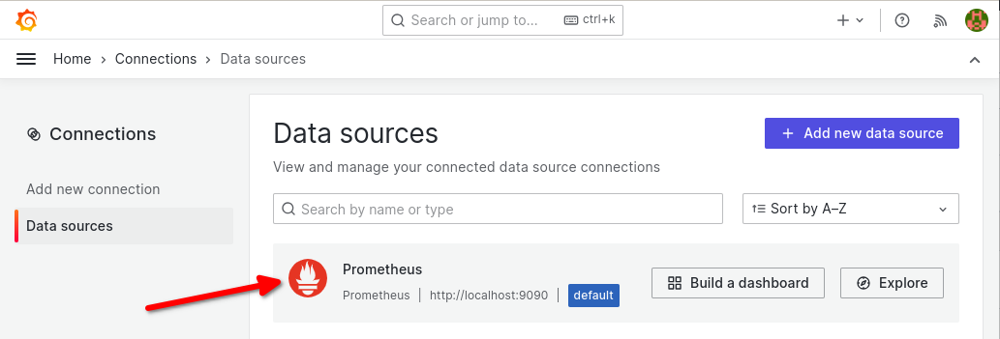
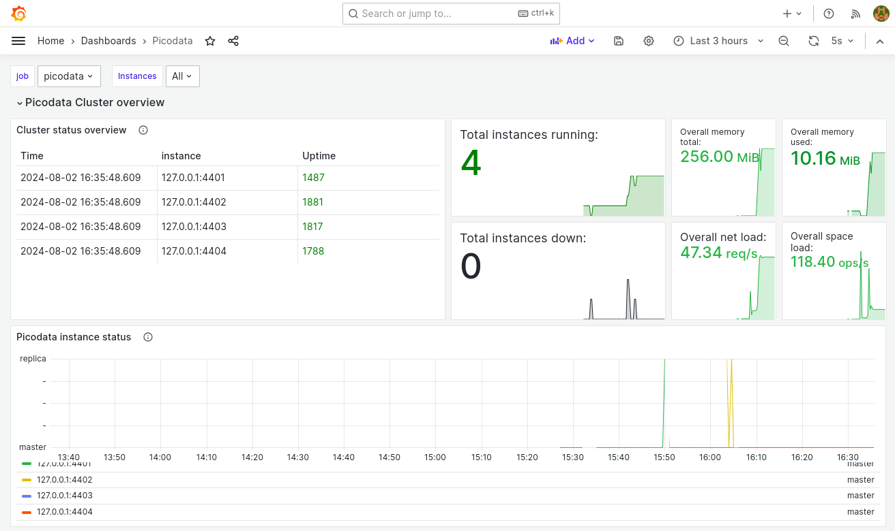

# Мониторинг кластера

В данном разделе приведена информация о мониторинге запущенного кластера Picodata.

Мониторинг состояния кластера возможен после
[подключения](connecting.md) к кластеру в консоли. После этого можно
использовать команды, показывающие состояние raft-группы, отдельных
инстансов, собранных из них репликасетов и т.д.

## Получение лидера raft-группы {: #getting_raft_leader }

Узнать лидера raft-группы, а также ID и статус текущего инстанса:

```
pico.raft_status()
```

Пример вывода:

```
---
- term: 2
  leader_id: 1
  raft_state: Leader
  id: 1
...
```

## Получение состава raft-группы {: #getting_raft_group }

Просмотр состава raft-группы и данных инстансов:

```
box.space._pico_instance:fselect()
```

Пример вывода:

```
---
- - ​+-----------+--------------------------------------+-------+-------------+--------------------------------------+-------------+------------+--------------+
  - ​|instance_id|            instance_uuid             |raft_id|replicaset_id|           replicaset_uuid            |current_state|target_state|failure_domain|
  - ​+-----------+--------------------------------------+-------+-------------+--------------------------------------+-------------+------------+--------------+
  - ​|   "i1"    |"68d4a766-4144-3248-aeb4-e212356716e4"|   1   |    "r1"     |"e0df68c5-e7f9-395f-86b3-30ad9e1b7b07"|["Online",1] |["Online",1]|      {}      |
  - ​|   "i2"    |"24c4ac5f-4981-3441-879c-aee1edb608a6"|   2   |    "r1"     |"e0df68c5-e7f9-395f-86b3-30ad9e1b7b07"|["Online",1] |["Online",1]|      {}      |
  - ​|   "i3"    |"5d7a7353-3e82-30fd-af0d-261436544389"|   3   |    "r2"     |"eff4449e-feb2-3d73-87bc-75807cb23191"|["Online",1] |["Online",1]|      {}      |
  - ​|   "i4"    |"826cbe5e-6979-3191-9e22-e39deef142f0"|   4   |    "r2"     |"eff4449e-feb2-3d73-87bc-75807cb23191"|["Online",1] |["Online",1]|      {}      |
  - ​+-----------+--------------------------------------+-------+-------------+--------------------------------------+-------------+------------+--------------+
...
```

Можно отдельно посмотреть список репликасетов, их UUID и вес:

```
box.space._pico_replicaset:fselect()
```

Пример вывода:

```
---
- — ​+-------------+--------------------------------------+---------+------+
  - ​|replicaset_id|           replicaset_uuid            |master_id|weight|
  - ​+-------------+--------------------------------------+---------+------+
  - ​|    "r1"     |"e0df68c5-e7f9-395f-86b3-30ad9e1b7b07"|  "i1"   |  1   |
  - ​|    "r2"     |"eff4449e-feb2-3d73-87bc-75807cb23191"|  "i3"   |  1   |
  - ​+-------------+--------------------------------------+---------+------+
...
```

Таблицы выше позволяют узнать текущий и целевой уровень ([state](../overview/glossary.md#state))
каждого инстанса, а также вес (`weight`) репликасета. Уровни отражают
конфигурацию остальных инстансов относительно текущего, а вес
репликасета — его наполненность репликами согласно фактору репликации
(см. [подробнее](../tutorial/deploy.md#failure_domains)). Вес репликасета определяет его
приоритет при распределении бакетов с данными.

## Получение версии схемы данных {: #getting_data_schema }

Узнать текущую версию схему данных можно с помощью команды:

```
box.space._pico_property:get("current_schema_version")
---
- ['current_schema_version', 1]
...
```

Каждое изменение схемы данных в кластере приводит к
увеличению этого номера.

## Метрики инстанса {: #instance_metrics }

Функциональность сбора метрик позволяет получать параметры работы СУБД
из инстанса Picodata и предоставлять доступ к ним для внешних систем в
формате Prometheus.


### Включение сбора метрик {: #enable_metrics }

Модуль сбора метрик автоматически включается при использовании
встроенного HTTP-сервера в Picodata. Для этого нужно при запуске
инстанса использовать параметр `--http-listen` и задать адрес
веб-сервера. Например:

```shell
picodata run --http-listen '127.0.0.1:8081'
```

### Получение метрик {: #access_metrics }

Метрики инстанса Picodata можно получить в консоли, используя `curl`:

```shell
curl --location 'http://127.0.0.1:8081/metrics'
```

### Настройка Prometheus {: #prometheus }

Для интеграции Picodata с системой мониторинга событий и оповещений
[Prometheus](https://prometheus.io) настройте новую цель в файле
`/etc/prometheus/prometheus.yml`:

```yaml
global:
  scrape_interval: 10s

scrape_configs:
  - job_name: 'prometheus'
    scrape_interval: 5s
    static_configs:
      - targets: ['127.0.0.1:9090']

  - job_name: 'picodata'
    scrape_interval: 5s
    metrics_path: /metrics
    static_configs:
      - targets: ['127.0.0.1:8081']
```

В приведенном примере:

- `127.0.0.1:9090` — адрес, с которого Prometheus будет отдавать метрики
- `127.0.0.1:8081` — адрес, с которого Prometheus собирает метрики
  (должен соответствовать параметру `--http-listen` при запуске инстанса
  Picodata)

Под каждый инстанс Picodata нужно выделять отдельный адрес сбора метрик.
Например, если локально запустить 4 инстанса Picodata, то файл
конфигурации Prometheus может выглядеть так:

```yaml
global:
  scrape_interval: 10s

scrape_configs:
  - job_name: 'prometheus'
    scrape_interval: 5s
    static_configs:
      - targets: ['127.0.0.1:9090']

  - job_name: 'picodata'
    scrape_interval: 5s
    metrics_path: /metrics
    static_configs:
      - targets: ['127.0.0.1:8081', '127.0.0.1:8082', '127.0.0.1:8083', '127.0.0.1:8084']
```

### Настройка Grafana {: #grafana }

Собранные в Prometheus метрики можно удобно просматривать в
веб-интерфейсе [Grafana]. Для этого выполните следующие шаги.

1.&nbsp;Убедитесь, что в настройках подключений в Grafana (`Connections` >
   `Data sources`) имеется источник данных Prometheus:



2.&nbsp;Импортируйте dashboard с данными Picodata. Для этого понадобится файл
   [Picodata.json], который следует добавить в меню `Dashboards` > `New` > `Import`:


После этого в Grafana можно будет оперативно отслеживать состояние
инстансов, потребляемую память, нагрузку на сеть, изменения в составе
кластера и прочие параметры:



[Grafana]: https://grafana.com/
[Picodata.json]: https://binary.picodata.io/repository/raw/picodata/monitoring/Picodata.json

<!-- См. также:

- [Справочник метрик](../reference/metrics.md)
 -->
