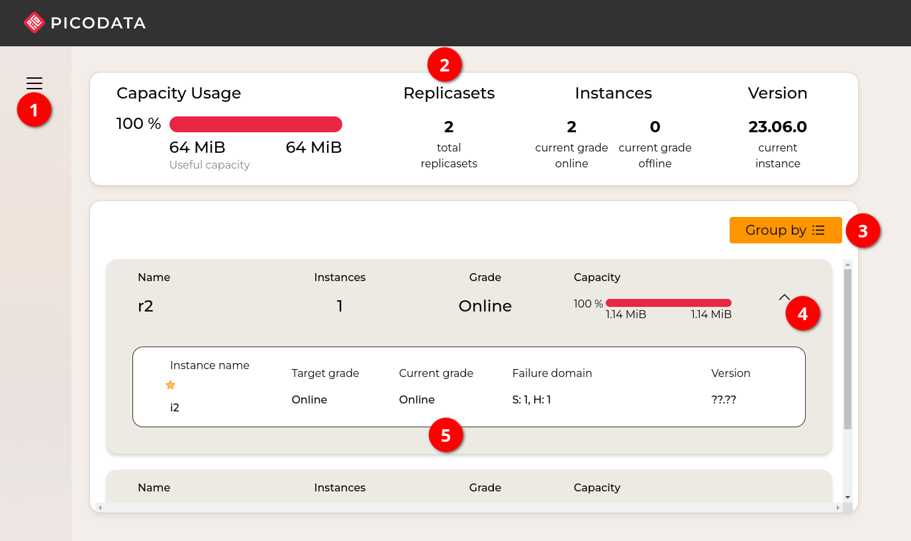
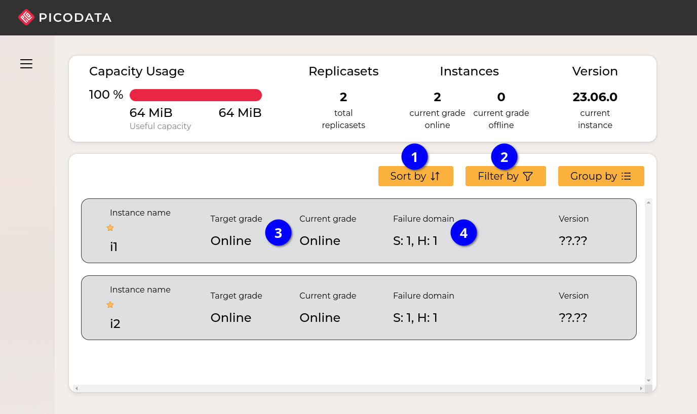

# Работа в веб-интерфейсе

В данном разделе приведены сведения, которые помогут начать работу с
веб-интерфейсом Picodata.

## Проверка перед подключением {: #check_avail }

На данный момент доступ к веб-интерфейсу возможен только если Picodata
была собрана из исходного кода. [Готовые
пакеты](https://picodata.io/download) пока не включают
данную функциональность.

Нужно убедиться, что при сборке Picodata c помощью `Cargo` был указан
параметр `--features webui`. Подробнее о сборке см. в разделе [Установка
Picodata](install.md).

## Подключение функции веб-интерфейса {: #enabling_webui }

Веб-интерфейс представляет собой веб-сервер, запускаемый вместе с
[инстансом](../overview/glossary.md#instance) Picodata. Не имеет значения, на каком
именно инстансе кластера запущен этот веб-сервер; в любом случае,
веб-сервер будет отображать данные обо всем кластере.

Для запуска инстанса с веб-сервером следует использовать параметр
[picodata run --http-listen]. Пример команды:

```bash
picodata run --http-listen 127.0.0.1:8080
```

[picodata run --http-listen]: ../reference/cli.md#run_http_listen

Можно запустить несколько инстансов с таким параметром, но нужно будет
указать разные адреса — таким образом у кластера будет несколько
веб-серверов.

## Доступ к веб-интерфейсу {: #accessing_webui }

В адресной строке веб-браузера введите адрес, указанный в виде значения
параметра `--http-listen`. Откроется страница с информацией о кластере
Picodata:



Данная страница предоставляет следующую полезную информацию о кластере:

<span style="color:red;font-size:150%">❶</span> — боковое меню,
позволяющее вывести список всех инстансов (узлов) кластера;<br>
<span style="color:red;font-size:150%">❷</span> — панель основной
информации о кластере: показателях памяти, количестве
[репликасетов](../overview/glossary.md#replicaset), [инстансов](../overview/glossary.md#instance) и их [стейтов](../overview/glossary.md#state), версии
Picodata;<br>
<span style="color:red;font-size:150%">❸</span> — кнопка выбора
группировки представления (по инстансам или репликасетам);<br>
<span style="color:red;font-size:150%">❹</span> — кнопка подробных
сведений о репликасете;<br>
<span style="color:red;font-size:150%">❺</span> — область подробных
сведений о репликасете.

По умолчанию, веб-интерфейс показывает список репликасетов кластера (в
данном примере их два). Если выбрать группировку по инстансам (<span
style="color:red;font-size:150%">❸</span>), то можно сразу увидеть
дополнительную информацию о состоянии инстансов:



Представление в виде списка инстансов содержит следующие элементы:

<span style="color:blue;font-size:150%">❶</span> — кнопка сортировки
инстансов по имени (нажатие переключает сортировку по
возрастанию/убыванию);<br>
<span style="color:blue;font-size:150%">❷</span> — кнопку фильтрации по
[домену отказа](../overview/glossary.md#failure_domain) (позволяет оставить в списке
только те инстансы, которые удовлетворяют заданному условию);<br>
<span style="color:blue;font-size:150%">❸</span> — текущий и целевой
стейты инстанса);<br>
<span style="color:blue;font-size:150%">❹</span> — домен
отказа инстанса;<br>

Подробности о запуске кластера Picodata приведены в разделе [Запуск
кластера](deploy.md).
